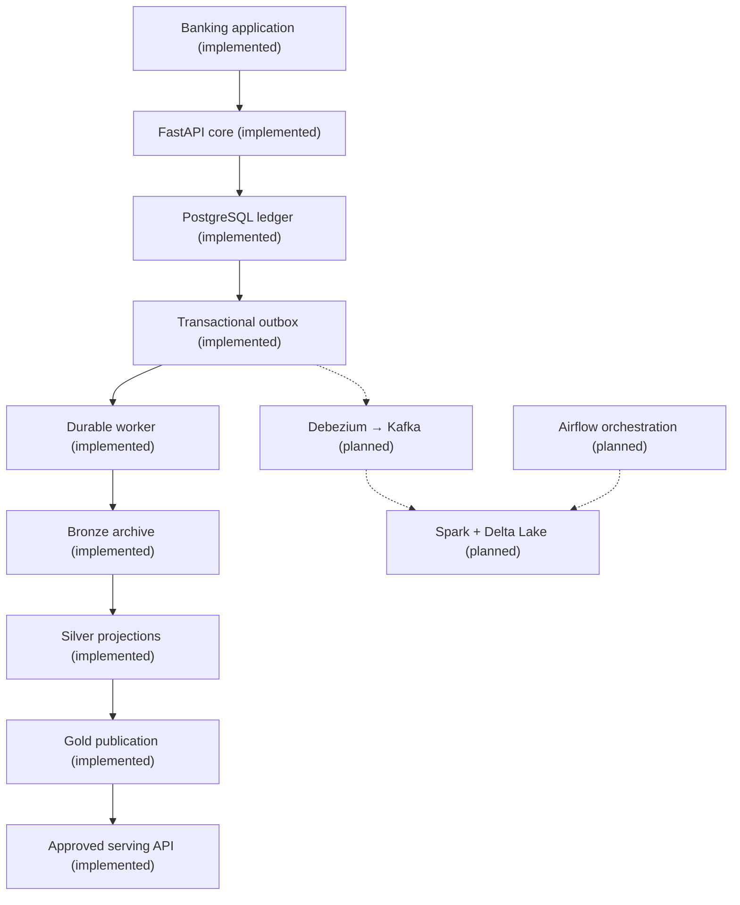

# Architecture generated from the shared manifest

Do not edit the diagram by hand. Run `python scripts/render_architecture.py`.

```mermaid
flowchart TD
  web["Banking application (implemented)"]
  api["FastAPI core (implemented)"]
  core["PostgreSQL ledger (implemented)"]
  outbox["Transactional outbox (implemented)"]
  worker["Durable worker (implemented)"]
  bronze["Bronze archive (implemented)"]
  silver["Silver projections (implemented)"]
  gold["Gold publication (implemented)"]
  serving["Approved serving API (implemented)"]
  cdc["Debezium → Kafka (planned)"]
  delta["Spark + Delta Lake (planned)"]
  airflow["Airflow orchestration (planned)"]
  web --> api
  api --> core
  core --> outbox
  outbox --> worker
  worker --> bronze
  bronze --> silver
  silver --> gold
  gold --> serving
  outbox -.-> cdc
  cdc -.-> delta
  airflow -.-> delta
```

Core development · single PostgreSQL host · no high availability
